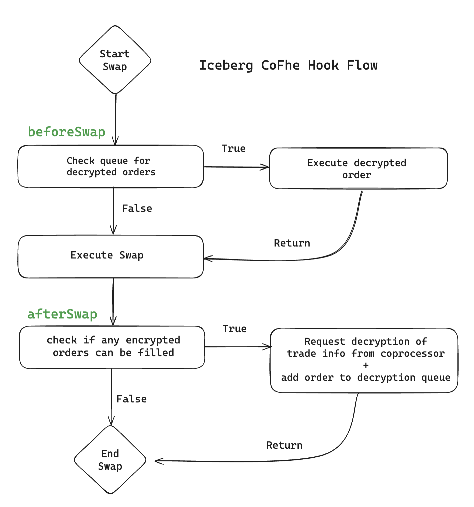

[](https://codecov.io/gh/marronjo/iceberg-cofhe)

# 🧊☕ iceberg-cofhe

> **FHE Encrypted Limit Orders on Uniswap v4**

**iceberg-cofhe** introduces confidential, iceberg-style limit orders to Uniswap v4 using [Fully Homomorphic Encryption (FHE)](https://fhenix.io/) via the [Fhenix coprocessor](https://cofhe-docs.fhenix.zone/docs/devdocs/overview). Limit order data like trade size and direction are encrypted on-chain and privately stored in the Iceberg hook   
— enabling privacy-preserving DeFi trading.

🔒 Built with FHE  
🦄 Runs as a Uniswap v4 hook  
🚀 Enables private, on-chain limit orders  

## 🌊 How It Works

- Users place encrypted limit orders through the hook (`placeIcebergOrder`) by providing encrypted values:
  - `liquidity`: order size
  - `zeroForOne`: swap direction
- The `ticklower` price is public, just like a traditional iceberg order. It shows the price you wish to execute a swap without exposing trade size or direction. e.g. the order could be 1 or 1,000,000 and it could be buying or selling token0/token1.
- Orders are stored in a privacy-preserving mapping, protected by FHE.
- In the `afterSwap()` callback the hook evaluates encrypted order conditions without leaking user intent.
- Once matching conditions are met, decryption is securely requested to fill the order.
- In the next `beforeSwap()` callback, the decryption result is requested.
  - If the decryption is ready, the order is filled.
  - Otherwise, the swap lifecycle continues   

## 🔁 Flow Diagram


## 🛠 Installation & Setup

Requires [foundry](https://book.getfoundry.sh).

```bash
#manage foundry toolchain
foundryup

#install dependencies e.g. Fhenix contract lib
forge install

#flag is required, or else stack too deep errors!
forge test --via-ir

#verbose logging and stack traces
forge test --via-ir -vvvv
```

## 🧪 Local Testing with Anvil

Other than writing unit tests (recommended!), you can only deploy & test hooks on [anvil](https://book.getfoundry.sh/anvil/)

```bash
# start anvil, a local EVM chain
anvil

# in a new terminal
forge script script/Anvil.s.sol \
    --rpc-url http://localhost:8545 \
    --private-key 0xac0974bec39a17e36ba4a6b4d238ff944bacb478cbed5efcae784d7bf4f2ff80 \
    --broadcast
```

See [script/](script/) for hook deployment, pool creation, liquidity provision, and swapping.

## 📖 Resources

Fhenix 🔒
- [FHE Hook Template](https://github.com/marronjo/fhe-hook-template)
- [CoFhe docs](https://cofhe-docs.fhenix.zone/docs/devdocs/overview)
- [FHERC20 Token Docs](https://cofhe-docs.fhenix.zone/docs/devdocs/fherc/fherc20)

Uniswap 🦄
- [Hook Examples](https://github.com/Uniswap/v4-periphery/tree/example-contracts/contracts/hooks/examples)
- [Uniswap v4 docs](https://docs.uniswap.org/contracts/v4/overview)  
- [v4-periphery](https://github.com/uniswap/v4-periphery)  
- [v4-core](https://github.com/uniswap/v4-core)  
- [v4-by-example](https://v4-by-example.org)  

Other 🧊
- [Traditional Iceberg Orders](https://www.investopedia.com/terms/i/icebergorder.asp)
